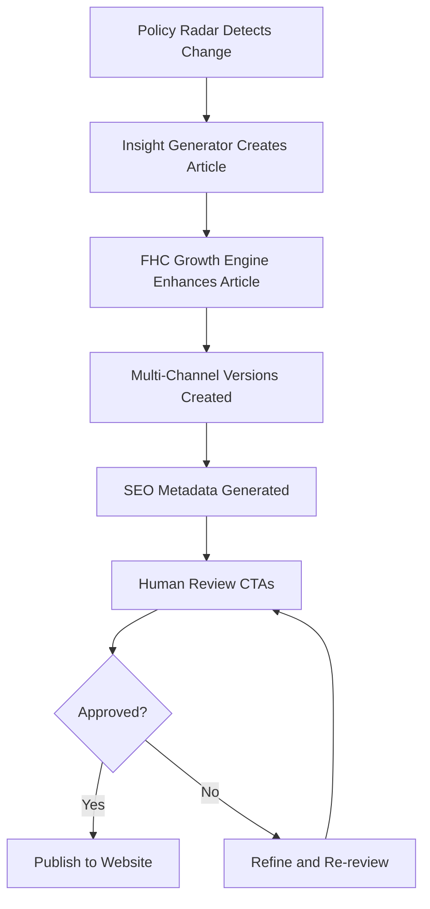

# Oney Website - AI Routines & Workflows

This document outlines the automated workflows and routines available for the Oney website project.

---

## 📋 Overview

This project uses **Claude Code Routines** to systematize content creation and growth strategies. The primary focus is converting educational content (Insights) into measurable conversion assets that drive users to the Financial Health Check (FHC).

---

## 🔁 Available Routines

### 1. Insight → FHC Growth Engine (`insight_to_fhc_growth_v1`)

**Location**: `.claude/routines/insight_to_fhc_growth_v1.md`

**Purpose**: Transform Insight articles into systematic conversion funnels for FHC.

**Key Features**:
- Audience mapping and pain point identification
- Conversion strategy design (Direct CTA / Educational CTA / Soft guidance)
- Multi-channel content adaptation (Web / XHS / LinkedIn)
- SEO optimization
- Conversion funnel design with tracking

**When to Use**:
- After creating a new Insight article
- When policy changes occur (e.g., First Home Guarantee updates)
- When new FHC features launch
- When market conditions shift (rates, affordability)

**How to Trigger**:

```
Claude Code, execute insight_to_fhc_growth_v1

Input:
- Article topic: [e.g., "First Home Guarantee 2026 expansion"]
- Target audience: [first home buyer / investor / refinance]
- Current market context: [e.g., "FHG expanded to 40K places, price caps increased"]
```

**Output Structure**:
```
outputs/insight-fhc-growth/YYYY-MM-DD-topic/
├── main-article.md          # Enhanced main article with CTAs
├── xhs-version.md           # 小红书 adapted version
├── linkedin-version.md      # LinkedIn professional version
├── seo-metadata.json        # SEO tags and structured data
├── analysis.json            # Strategy, funnel design, metrics
└── funnel-design.json       # Detailed conversion pathway
```

---

## 📁 Project Structure

```
oney-website/
├── .claude/
│   └── routines/                    # Routine definitions
│       ├── insight_to_fhc_growth_v1.md
│       └── insight_to_fhc_growth_template.md
├── outputs/
│   └── insight-fhc-growth/          # Generated content outputs
│       └── YYYY-MM-DD-topic/
├── assets/
│   ├── css/
│   └── js/
├── data/                            # Data files
├── images/                          # Image assets
├── tools/                           # Interactive tools
├── index.html                       # Home page
├── insights.html                    # Insights listing page
├── fhc.html                         # Financial Health Check page
└── CLAUDE.md                        # This file
```

---

## 🎯 Content Strategy Framework

### Core Principle

```
Insight ≠ Content for reading
Insight = Conversion entry point
```

Every Insight article must have:
1. **Clear target user** (first home buyer / investor / refinance)
2. **Identified pain point**
3. **Natural FHC integration**
4. **Measurable conversion pathway**

---

### User Journey Mapping

| User Type | Behavior | Intent Level | CTA Strategy |
|-----------|----------|--------------|--------------|
| **Informational** | Researching, learning | Low | Educational CTA: "Learn how FHC can help" |
| **Evaluative** | Comparing options | Medium | Explanatory CTA: "See your exact numbers" |
| **Decisional** | Ready to act | High | Direct CTA: "Get your free FHC now" |

---

### Conversion Mechanism

```
Pain Point 
    ↓
Explanation (build understanding)
    ↓
Anxiety/Urgency (create motivation)
    ↓
Solution (introduce FHC)
    ↓
CTA (clear next action)
    ↓
FHC Entry
```

---

## 📊 Success Metrics

### Primary Metrics
- **CTR** (Article → FHC): Target 8-12%
- **FHC Completion Rate**: Target 60%+
- **FHC → Broker Booking**: Target 20-25%

### Secondary Metrics
- Time on page
- Scroll depth
- Multi-channel performance (Web vs XHS vs LinkedIn)
- Topic resonance (which pain points convert best)

### Tracking Implementation

Add UTM parameters to all FHC CTAs:
```
https://oney.co/fhc?source=insight&medium=article&campaign=[topic]&content=[cta-position]
```

---

## 🧠 Routine Integration Logic



**Future Routines** (to be integrated):
- `insight_generator_v1`: Automated Insight article creation based on policy/market changes
- `policy_radar_monitor_v1`: Monitors Australian housing policy updates

---

## ✅ Content Quality Checklist

Before publishing any Insight enhanced by `insight_to_fhc_growth_v1`, verify:

### Content Quality
- [ ] Article provides genuine value (not just a sales pitch)
- [ ] Data and statistics are current and accurate
- [ ] Examples are realistic and relatable
- [ ] Language is clear and accessible

### Conversion Quality
- [ ] CTA feels natural, not forced
- [ ] FHC value proposition is clear
- [ ] User understands what happens after clicking CTA
- [ ] Multiple CTA placements (mid-article + end)

### Technical Quality
- [ ] All links work correctly
- [ ] UTM parameters are properly formatted
- [ ] SEO metadata is complete
- [ ] Images are optimized (if applicable)

### Multi-Channel Quality
- [ ] XHS version has strong hook and simplified CTA
- [ ] LinkedIn version is professional and industry-focused
- [ ] Each version maintains core message consistency

---

## 🚨 Important Rules

### ✅ Automated (Safe)
- Content generation
- Multi-channel adaptation
- SEO optimization
- File output to `/outputs/`

### ⚠️ Requires Human Review
- All CTAs (especially in early phases)
- Conversion strategy selection
- Tone and messaging appropriateness
- Claims about savings/benefits

### ❌ Never Automated
- Publishing to production website
- Posting to social media channels
- Modifying production database
- Sending customer communications

---

## 📖 Usage Examples

### Example 1: Policy Update

```
User: "The First Home Guarantee just expanded to 40,000 places. Create an Insight about this."

Claude Code:
1. Executes insight_to_fhc_growth_v1
2. Generates comprehensive article explaining the change
3. Identifies target user: First Home Buyers aged 25-35
4. Creates CTAs around "check your eligibility"
5. Outputs multi-channel versions
6. Presents for human review
```

### Example 2: Market Shift

```
User: "Interest rates just dropped 0.25%. How should we position FHC?"

Claude Code:
1. Analyzes market context
2. Identifies pain point: "increased competition for properties"
3. Creates Insight about "What rate cuts mean for first-home buyers"
4. Embeds FHC as "lock in your borrowing power now" tool
5. Generates urgency-driven CTAs
6. Outputs complete package
```

---

## 🔄 Iteration & Improvement

### A/B Testing Recommendations

Track and test:
1. **CTA Placement**: Mid-article only vs Mid + End
2. **CTA Language**: Tool-focused vs Benefit-focused
3. **Article Length**: Long-form vs Medium-form
4. **Visual Elements**: With calculations/tables vs Text-only

### Continuous Optimization

Monthly review:
- Which topics drive highest conversion?
- Which CTAs perform best?
- Where do users drop off in funnel?
- Which channels perform best (Web vs XHS vs LinkedIn)?

---

## 🤝 Contributing

### Adding New Routines

1. Create routine spec in `.claude/routines/[routine_name].md`
2. Define clear triggers, inputs, outputs
3. Specify validation rules
4. Document integration points with existing routines
5. Update this CLAUDE.md file

### Modifying Existing Routines

1. Test changes in `/outputs/test/` first
2. Document changes in routine file
3. Update version number if significant
4. Notify team of breaking changes

---

## 📞 Support & Questions

For questions about:
- **Routine execution**: Ask Claude Code directly
- **Content strategy**: Review `.claude/routines/insight_to_fhc_growth_v1.md`
- **Technical issues**: Check output files in `/outputs/insight-fhc-growth/`

---

## 🎓 Learning Resources

### Understanding the System

1. **Start here**: Read `.claude/routines/insight_to_fhc_growth_v1.md`
2. **See it in action**: Review example output in `/outputs/insight-fhc-growth/2026-04-29-first-home-guarantee-expansion/`
3. **Understand strategy**: Review `analysis.json` in any output folder

### Best Practices

- **Think funnel-first**: Every article is a conversion pathway
- **User-centric**: Always identify the specific pain point
- **Natural CTAs**: Never hard-sell; educate then invite
- **Multi-channel**: One core message, adapted for each platform
- **Measure everything**: UTM tags on all links

---

*Last updated: 2026-04-29*  
*Routine version: insight_to_fhc_growth_v1*
